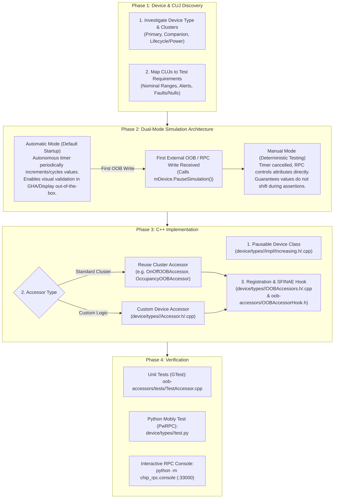

# Adding Pigweed RPC & Out-Of-Band Control to `all-devices-app` Devices

## Overview & Architecture

`all-devices-app` provides a unified Matter virtual device runtime used for local testing, visual validation in consumer apps (Google Home App / Smart Displays), and automated End-to-End integration testing (Mobly / Inception / CI).

To support both **interactive visual exploration** and **deterministic test automation**, devices follow a **Dual-Mode Simulation Architecture**:



### Out-of-Band (OOB) Control Dispatch Pipeline

The architecture strictly decouples transport protocols (Pigweed RPC, POSIX Named Pipes, Test Event Triggers) from cluster execution logic:

```mermaid
flowchart LR
    subgraph Transports["Transports & External Interfaces"]
        RPC["Pigweed RPC\n(chip.rpc.Attributes.Write)"]
        Pipe["POSIX Named Pipe\n(JSON commands)"]
    end

    subgraph Interceptors["Interceptors / Translators"]
        PwAcc["PigweedAttributeAccessor"]
        PipeDisp["NamedPipe::Dispatcher\n& CommandTranslators"]
    end

    subgraph Core["Core Dispatch"]
        Reg["OOBAccessorRegistry\nHandleAction('SetAttribute', TLV)"]
        Acc["OOBAccessor\n(Cluster or Device Accessor)"]
    end

    subgraph DeviceModel["Device & Data Model"]
        Dev["Device (PauseSimulation)"]
        Cluster["Server Cluster Instance"]
    end

    RPC --> PwAcc
    Pipe --> PipeDisp
    PwAcc -->|SetAttribute + TLV| Reg
    PipeDisp -->|Action + TLV| Reg
    Reg --> Acc
    Acc -->|PauseSimulation()| Dev
    Acc -->|Set...()| Cluster
```

1. **Transport Layer**:
   - **Pigweed RPC**: Receives proto requests (`attributes_service_pb2.AttributeData`), intercepted by `PigweedAttributeAccessor`.
   - **Named Pipes**: Receives JSON requests (`{"Name": "SetOnOff", "EndpointId": 1, "OnOff": true}`), processed by `NamedPipe::Dispatcher`.
2. **Standard Serialization**: Requests are serialized into flat TLV buffers via `OOBDataSerializer::BuildSetAttributeRequest`.
3. **Dispatch Registry**: `OOBAccessorRegistry::Instance().HandleAction(...)` queries registered accessors.
4. **Accessor Execution**: The matching `OOBAccessor` unpacks the TLV data, immediately invokes `mDevice.PauseSimulation()`, and writes the value to the cluster.

### Static Hook Registration Architecture (`OOBAccessorHook`)

To prevent circular build dependencies between the central accessor registry and individual device types:
- `DeviceFactory` does not maintain a monolithic manual creator map.
- Instead, `DeviceFactory::MakeDevice<TDevice>(...)` invokes `OOBAccessorHook::OnDeviceRegistered(*rawDevice)`.
- `OOBAccessorHook` uses C++17 SFINAE (`std::void_t`) to detect if a free function exists matching the signature:
  ```cpp
  void RegisterOOBAccessors(TDevice & device, OOBAccessorRegistry & registry);
  ```
- If found, it registers the device's accessors with the registry upon device creation.
- **Location Rule**: Device accessors and their `OOBAccessors.h/.cpp` registration files must reside **inside the device's own directory** (`examples/all-devices-app/all-devices-common/device/types/<device-type>/`). This allows `device/types/<device>` to depend on `oob-accessors` without circular GN dependency loops.

---

## Core File Paths

When developing or modifying devices in `all-devices-app`, consult and integrate with these core files:

### Documentation
- **OOB Architecture Design Doc**: [`examples/all-devices-app/docs/design/out_of_band_control.md`](file:///usr/local/google/home/rgoliver/repo/connectedhomeip/examples/all-devices-app/docs/design/out_of_band_control.md)
- **All-Devices Architecture**: [`examples/all-devices-app/docs/architecture.md`](file:///usr/local/google/home/rgoliver/repo/connectedhomeip/examples/all-devices-app/docs/architecture.md)

### Base Interfaces & Accessor Infrastructure
- **Device Base Interface**: [`examples/all-devices-app/all-devices-common/device/api/Interface.h`](file:///usr/local/google/home/rgoliver/repo/connectedhomeip/examples/all-devices-app/all-devices-common/device/api/Interface.h) (`DeviceInterface`)
- **Single Endpoint Base**: [`examples/all-devices-app/all-devices-common/device/api/SingleEndpoint.h`](file:///usr/local/google/home/rgoliver/repo/connectedhomeip/examples/all-devices-app/all-devices-common/device/api/SingleEndpoint.h) (`SingleEndpoint`)
- **Timer Delegate (Simulation Loop)**: [`src/lib/support/TimerDelegate.h`](file:///usr/local/google/home/rgoliver/repo/connectedhomeip/src/lib/support/TimerDelegate.h) (`TimerDelegate`, `TimerContext`)
- **OOB Accessor Base Interface**: [`examples/all-devices-app/all-devices-common/oob-accessors/OOBAccessor.h`](file:///usr/local/google/home/rgoliver/repo/connectedhomeip/examples/all-devices-app/all-devices-common/oob-accessors/OOBAccessor.h) (`OOBAccessor`)
- **OOB Accessor Registry**: [`examples/all-devices-app/all-devices-common/oob-accessors/OOBAccessorRegistry.h`](file:///usr/local/google/home/rgoliver/repo/connectedhomeip/examples/all-devices-app/all-devices-common/oob-accessors/OOBAccessorRegistry.h) (`OOBAccessorRegistry`)
- **OOB Accessor Hook (SFINAE)**: [`examples/all-devices-app/all-devices-common/oob-accessors/OOBAccessorHook.h`](file:///usr/local/google/home/rgoliver/repo/connectedhomeip/examples/all-devices-app/all-devices-common/oob-accessors/OOBAccessorHook.h)
- **OOB TLV Request Serializer**: [`examples/all-devices-app/all-devices-common/oob-accessors/OOBDataSerializer.h`](file:///usr/local/google/home/rgoliver/repo/connectedhomeip/examples/all-devices-app/all-devices-common/oob-accessors/OOBDataSerializer.h)
- **Pigweed Attribute Interceptor**: [`examples/all-devices-app/all-devices-common/oob-accessors/pigweed/PigweedAttributeAccessor.h`](file:///usr/local/google/home/rgoliver/repo/connectedhomeip/examples/all-devices-app/all-devices-common/oob-accessors/pigweed/PigweedAttributeAccessor.h)
- **Device Factory**: [`examples/all-devices-app/all-devices-common/device-factory/DeviceFactory.h`](file:///usr/local/google/home/rgoliver/repo/connectedhomeip/examples/all-devices-app/all-devices-common/device-factory/DeviceFactory.h)
- **Reusable Cluster Accessors**: [`examples/all-devices-app/all-devices-common/oob-accessors/clusters/`](file:///usr/local/google/home/rgoliver/repo/connectedhomeip/examples/all-devices-app/all-devices-common/oob-accessors/clusters/)
  - `OnOffOOBAccessor.h/.cpp` (On/Off cluster)
  - `OccupancyOOBAccessor.h/.cpp` (Occupancy Sensing cluster)
  - `BooleanStateOOBAccessor.h/.cpp` (Boolean State cluster)
  - `ModeSelectOOBAccessor.h/.cpp` (Mode Select cluster)
  - `AmbientContextOOBAccessor.h/.cpp` (Ambient Context cluster)
  - `RvcOOBAccessor.h/.cpp` (Robotic Vacuum Cleaner cluster)
  - `ElectricalEnergyMeasurementOOBAccessor.h/.cpp` (EEM cluster)
  - `BasicInformationOOBAccessor.h/.cpp` (Basic Information cluster)

### Data Model References
- **Standard Device Type IDs**: [`zzz_generated/app-common/devices/Ids.h`](file:///usr/local/google/home/rgoliver/repo/connectedhomeip/zzz_generated/app-common/devices/Ids.h)
- **Standard Device Type Entries**: [`zzz_generated/app-common/devices/Types.h`](file:///usr/local/google/home/rgoliver/repo/connectedhomeip/zzz_generated/app-common/devices/Types.h)
- **Generated Cluster Definitions**: `zzz_generated/app-common/clusters/<ClusterName>/`
- **Code-Driven Server Clusters**: `src/app/clusters/*-server/`

### Upstream Reference Implementations
Consult these upstream implementations in the codebase as structural templates:
- **Reusable Cluster Accessor Pattern**:
  - [`device/types/occupancy-sensor/OccupancySensor.h`](file:///usr/local/google/home/rgoliver/repo/connectedhomeip/examples/all-devices-app/all-devices-common/device/types/occupancy-sensor/OccupancySensor.h)
  - [`device/types/occupancy-sensor/OOBAccessors.h`](file:///usr/local/google/home/rgoliver/repo/connectedhomeip/examples/all-devices-app/all-devices-common/device/types/occupancy-sensor/OOBAccessors.h) / [`OOBAccessors.cpp`](file:///usr/local/google/home/rgoliver/repo/connectedhomeip/examples/all-devices-app/all-devices-common/device/types/occupancy-sensor/OOBAccessors.cpp) (wires `OccupancyOOBAccessor`)
- **End-to-End Pigweed RPC Python Mobly Test Pattern**:
  - [`device/types/boolean-state-sensor/test.py`](file:///usr/local/google/home/rgoliver/repo/connectedhomeip/examples/all-devices-app/all-devices-common/device/types/boolean-state-sensor/test.py) (uses `attributes_service_pb2` and `pw_system` over TCP 33000)
- **Complex Multi-Action Accessor Pattern**:
  - [`device/types/ambient-context-sensor/OOBAccessors.cpp`](file:///usr/local/google/home/rgoliver/repo/connectedhomeip/examples/all-devices-app/all-devices-common/device/types/ambient-context-sensor/OOBAccessors.cpp) (wires `AmbientContextOOBAccessor` handling custom TLV commands)

---

## Reusable Architecture Patterns & Code Snippets

### Pattern 1: Dual-Mode Pausable Sensor (`Increasing<Device>`)

This pattern runs an autonomous timer on startup (enabling immediate visual demo in Google Home App or displays), and pauses immediately upon the first Pigweed RPC write so automated test assertions remain deterministic.

#### Header: `Increasing<Device>.h`
```cpp
#pragma once
#include <device/types/<device>/<Device>.h>
#include <lib/support/TimerDelegate.h>

namespace chip::app {

class Increasing<Device> : public <Device>, public TimerContext
{
public:
    Increasing<Device>();
    ~Increasing<Device>() override;

    CHIP_ERROR Register(EndpointId endpoint, CodeDrivenDataModelProvider & provider,
                        EndpointComposition composition = EndpointComposition::kFull) override;
    void Unregister(CodeDrivenDataModelProvider & provider) override;

    // Simulation control interface
    void PauseSimulation() override;
    void ResumeSimulation() override;
    bool IsSimulationPaused() const { return mSimulationPaused; }

    // TimerContext callback
    void TimerFired() override;

private:
    TimerDelegate & mTimerDelegate;
    bool mSimulationPaused = false;
    DataModel::Nullable<chip::Percent> mMeasuredValue;
};

} // namespace chip::app
```

#### Implementation: `Increasing<Device>.cpp`
```cpp
#include "Increasing<Device>.h"
#include <lib/support/logging/CHIPLogging.h>

namespace chip::app {

namespace {
constexpr System::Clock::Seconds16 kUpdateIntervalSec = System::Clock::Seconds16(10);
constexpr uint8_t kMinVal = 0;
constexpr uint8_t kMaxVal = 100;
} // namespace

Increasing<Device>::Increasing<Device>() :
    <Device>(mTimerDelegate)
{}

Increasing<Device>::~Increasing<Device>()
{
    mTimerDelegate.CancelTimer(this);
}

CHIP_ERROR Increasing<Device>::Register(EndpointId endpoint, CodeDrivenDataModelProvider & provider,
                                        EndpointComposition composition)
{
    ReturnErrorOnFailure(<Device>::Register(endpoint, provider, composition));
    // Start autonomous cycling in Automatic Mode
    return mTimerDelegate.StartTimer(this, kUpdateIntervalSec);
}

void Increasing<Device>::Unregister(CodeDrivenDataModelProvider & provider)
{
    mTimerDelegate.CancelTimer(this);
    <Device>::Unregister(provider);
}

void Increasing<Device>::PauseSimulation()
{
    mSimulationPaused = true;
    mTimerDelegate.CancelTimer(this);
}

void Increasing<Device>::ResumeSimulation()
{
    mSimulationPaused = false;
    mTimerDelegate.StartTimer(this, kUpdateIntervalSec);
}

void Increasing<Device>::TimerFired()
{
    // Freeze the autonomous loop once an external RPC command has arrived
    if (mSimulationPaused)
    {
        return;
    }

    // Cycle between bounds
    if (mMeasuredValue.IsNull() || mMeasuredValue.Value() >= kMaxVal)
    {
        mMeasuredValue.SetNonNull(kMinVal);
    }
    else
    {
        mMeasuredValue.SetNonNull(static_cast<chip::Percent>(mMeasuredValue.Value() + 1));
    }

    ChipLogProgress(AppServer, "Autonomous simulation value: %u", mMeasuredValue.Value());
    LogErrorOnFailure(mPrimaryCluster.Cluster().SetMeasuredValue(mMeasuredValue));

    // Re-arm timer
    mTimerDelegate.StartTimer(this, kUpdateIntervalSec);
}

} // namespace chip::app
```

> [!NOTE]
> Do NOT include platform-layer headers like `<platform/CHIPDeviceLayer.h>` in common device simulation code. This keeps `all-devices-common` modular and avoids pulling in platform-specific BlueZ/GIO dependencies on host builds.

---

### Pattern 2: Reusing Existing Cluster Accessors

If your device uses standard clusters already implemented in `oob-accessors/clusters/` (e.g. `OnOff`, `OccupancySensing`, `BooleanState`, `ModeSelect`), **do not write a custom accessor class**. Simply register the existing cluster accessor in `OOBAccessors.cpp`:

```cpp
#include "OOBAccessors.h"
#include "<Device>.h"
#include <lib/support/CodeUtils.h>
#include <oob-accessors/OOBAccessorRegistry.h>
#include <oob-accessors/clusters/OnOffOOBAccessor.h>

namespace chip::app {

void RegisterOOBAccessors(<Device> & device, OOBAccessorRegistry & registry)
{
    LogErrorOnFailure(registry.Register(
        std::make_unique<OnOffOOBAccessor>(device.OnOffCluster(), device.GetEndpointId())));
}

} // namespace chip::app
```

For composite devices with multiple sub-endpoints, register an accessor for each sub-endpoint:

```cpp
void RegisterOOBAccessors(CompositeDevice & device, OOBAccessorRegistry & registry)
{
    LogErrorOnFailure(registry.Register(
        std::make_unique<OnOffOOBAccessor>(device.Part1().OnOffCluster(), device.Part1().GetEndpointId())));
    LogErrorOnFailure(registry.Register(
        std::make_unique<OnOffOOBAccessor>(device.Part2().OnOffCluster(), device.Part2().GetEndpointId())));
}
```

---

### Pattern 3: Custom Device Accessor (`OOBAccessor`)

When a device needs custom decoding logic (such as converting units, simulating probe faults on null, or handling custom cluster write actions), write a dedicated accessor located directly in the device's directory:

#### Header: `device/types/<device>/<Device>Accessor.h`
```cpp
#pragma once

#include <optional>

#include <app/AttributeValueDecoder.h>
#include <app/ConcreteAttributePath.h>
#include <device/types/<device>/<Device>.h>
#include <lib/core/CHIPError.h>
#include <lib/support/Span.h>
#include <oob-accessors/OOBAccessor.h>

namespace chip::app {

class <Device>Accessor : public OOBAccessor
{
public:
    explicit <Device>Accessor(<Device> & device) : mDevice(device) {}
    ~<Device>Accessor() override = default;

    std::optional<CHIP_ERROR> HandleAction(CharSpan actionName, ByteSpan tlvBuffer) override;

private:
    std::optional<CHIP_ERROR> SetAttribute(const ConcreteDataAttributePath & path, AttributeValueDecoder & decoder);

    <Device> & mDevice;
};

} // namespace chip::app
```

#### Implementation: `device/types/<device>/<Device>Accessor.cpp`
```cpp
#include "<Device>Accessor.h"
#include <access/SubjectDescriptor.h>
#include <lib/support/CodeUtils.h>
#include <lib/support/logging/CHIPLogging.h>
#include <oob-accessors/OOBDataSerializer.h>

using namespace chip::app::Clusters;

namespace chip::app {

std::optional<CHIP_ERROR> <Device>Accessor::HandleAction(CharSpan actionName, ByteSpan tlvBuffer)
{
    if (!actionName.data_equal("SetAttribute"_span))
    {
        return std::nullopt;
    }

    auto parseResult = OOBDataSerializer::ParseAttributeRequest(tlvBuffer);
    if (std::holds_alternative<CHIP_ERROR>(parseResult))
    {
        CHIP_ERROR err = std::get<CHIP_ERROR>(parseResult);
        ChipLogError(Support, "Failed to parse attribute request: %" CHIP_ERROR_FORMAT, err.Format());
        return err;
    }

    auto & request = std::get<OOBDataSerializer::AttributeRequest>(parseResult);
    if (request.path.mEndpointId != mDevice.GetEndpointId())
    {
        return std::nullopt;
    }

    // Zero-initialize SubjectDescriptor to avoid -Wmissing-designated-field-initializers
    Access::SubjectDescriptor subjectDescriptor = {};
    subjectDescriptor.authMode                  = chip::Access::AuthMode::kInternalDeviceAccess;
    AttributeValueDecoder decoder(request.value, subjectDescriptor);

    return SetAttribute(request.path, decoder);
}

std::optional<CHIP_ERROR> <Device>Accessor::SetAttribute(const ConcreteDataAttributePath & path,
                                                         AttributeValueDecoder & decoder)
{
    // Immediately pause simulation on first explicit write
    mDevice.PauseSimulation();

    switch (path.mClusterId)
    {
    case <PrimaryCluster>::Id: {
        switch (path.mAttributeId)
        {
        case <PrimaryCluster>::Attributes::<Attribute>::Id: {
            DataModel::Nullable<uint16_t> rawValue;
            ReturnErrorOnFailure(decoder.Decode(rawValue));

            DataModel::Nullable<chip::Percent> measuredValue;
            if (rawValue.IsNull())
            {
                measuredValue.SetNull(); // Simulates hardware probe fault / disconnection
            }
            else
            {
                uint16_t val = rawValue.Value();
                // Normalize scaled test values if needed (e.g. 4200 -> 42%)
                if (val > 100)
                {
                    val = static_cast<uint16_t>(val / 100);
                }
                measuredValue.SetNonNull(static_cast<chip::Percent>(val));
            }
            return mDevice.<PrimaryCluster>().Set<Attribute>(measuredValue);
        }
        default:
            return CHIP_IM_GLOBAL_STATUS(UnsupportedWrite);
        }
    }
    default:
        return std::nullopt;
    }
}

} // namespace chip::app
```

> [!WARNING]
> In C++20 with `-Werror`, avoid designated initializers with omitted fields like `Access::SubjectDescriptor s{ .authMode = ... };`. Always initialize with `= {}` then assign fields, avoiding compiler warning `-Wmissing-designated-field-initializers`.

---

### Pattern 4: Hook Registration (`OOBAccessors.h` & `OOBAccessors.cpp`)

Every device supporting OOB actions provides a registration pair:

#### Header: `device/types/<device>/OOBAccessors.h`
```cpp
#pragma once

#include <device/types/<device>/<Device>.h>
#include <oob-accessors/OOBAccessorRegistry.h>

namespace chip::app {

void RegisterOOBAccessors(<Device> & device, OOBAccessorRegistry & registry);

} // namespace chip::app
```

#### Implementation: `device/types/<device>/OOBAccessors.cpp`
```cpp
#include "OOBAccessors.h"
#include "<Device>.h"
#include "<Device>Accessor.h"
#include <lib/support/CodeUtils.h>
#include <oob-accessors/OOBAccessorRegistry.h>

namespace chip::app {

void RegisterOOBAccessors(<Device> & device, OOBAccessorRegistry & registry)
{
    LogErrorOnFailure(registry.Register(std::make_unique<<Device>Accessor>(device)));
}

} // namespace chip::app
```

#### Hook Inclusion: `oob-accessors/OOBAccessorHook.h`
Add the device header to `OOBAccessorHook.h` (in alphabetical order):
```cpp
#include <device/types/<device>/OOBAccessors.h>
```
`DeviceFactory::MakeDevice<TDevice>()` will automatically detect and register the accessors via `OOBAccessorHook`.

---

### Pattern 5: Unit Test Fixture (`Test<Device>Accessor.cpp`)

Place tests in [`examples/all-devices-app/all-devices-common/oob-accessors/tests/Test<Device>Accessor.cpp`](file:///usr/local/google/home/rgoliver/repo/connectedhomeip/examples/all-devices-app/all-devices-common/oob-accessors/tests/TestSoilSensorAccessor.cpp):

```cpp
#include <gtest/gtest.h>
#include <app/data-model-provider/tests/MockCodeDrivenDataModelStorage.h>
#include <app/data-model-provider/tests/TestAttributeStorage.h>
#include <device/types/<device>/impl/Increasing<Device>.h>
#include <device/types/<device>/<Device>Accessor.h>
#include <oob-accessors/OOBDataSerializer.h>

using namespace chip;
using namespace chip::app;
using namespace chip::app::Clusters;

class Test<Device>Accessor : public ::testing::Test
{
protected:
    static constexpr EndpointId kTestEndpoint = 1;

    Test<Device>Accessor() : mProvider(mStorage, mAttrStorage) {}

    void SetUp() override
    {
        ASSERT_EQ(mDevice.Register(kTestEndpoint, mProvider), CHIP_NO_ERROR);
    }

    void TearDown() override
    {
        mDevice.Unregister(mProvider);
    }

    CHIP_ERROR SerializeWriteRequest(const ConcreteDataAttributePath & path,
                                     const DataModel::Nullable<uint16_t> & val,
                                     MutableByteSpan & outBuffer)
    {
        TLV::TLVWriter writer;
        writer.Init(outBuffer);
        TLV::TLVType outer;
        ReturnErrorOnFailure(writer.StartContainer(TLV::AnonymousTag(), TLV::kTLVType_Structure, outer));
        ReturnErrorOnFailure(OOBDataSerializer::SerializePath(writer, TLV::ContextTag(1), path));
        ReturnErrorOnFailure(DataModel::Encode(writer, TLV::ContextTag(2), val));
        ReturnErrorOnFailure(writer.EndContainer(outer));
        ReturnErrorOnFailure(writer.Finalize());
        outBuffer.reduce_size(writer.GetLengthWritten());
        return CHIP_NO_ERROR;
    }

    MockCodeDrivenDataModelStorage mStorage;
    TestAttributeStorage mAttrStorage;
    CodeDrivenDataModelProvider mProvider;
    Increasing<Device> mDevice;
};

TEST_F(Test<Device>Accessor, SimulationPausedOnWrite)
{
    <Device>Accessor accessor(mDevice);
    EXPECT_FALSE(mDevice.IsSimulationPaused());

    uint8_t buffer[64];
    MutableByteSpan tlvSpan(buffer);
    ConcreteDataAttributePath path(kTestEndpoint, <PrimaryCluster>::Id, <PrimaryCluster>::Attributes::<Attribute>::Id);
    ASSERT_EQ(SerializeWriteRequest(path, DataModel::MakeNullable(static_cast<uint16_t>(50)), tlvSpan), CHIP_NO_ERROR);

    auto result = accessor.HandleAction("SetAttribute"_span, tlvSpan);
    ASSERT_TRUE(result.has_value());
    EXPECT_EQ(result.value(), CHIP_NO_ERROR);

    // Verify simulation is now halted
    EXPECT_TRUE(mDevice.IsSimulationPaused());
}
```

---

### Pattern 6: Python Mobly Integration Test (`test.py`)

Create a Python integration test script in `examples/all-devices-app/all-devices-common/device/types/<device>/test.py` to automate end-to-end testing with Pigweed RPC:

```python
import logging
from attributes_service import attributes_service_pb2
from mobly import asserts
from pw_hdlc import rpc
from pw_system.device_connection import create_device_serial_or_socket_connection

import matter.clusters as Clusters
from matter.testing.decorators import async_test_body
from matter.testing.matter_testing import MatterBaseTest
from matter.testing.runner import default_matter_test_main

logger = logging.getLogger(__name__)

class DevicePigweedControlTest(MatterBaseTest):
    """Test commissioning and Pigweed RPC out-of-band control."""

    async def read_measured_value(self, endpoint: int):
        return await self.read_single_attribute_check_success(
            endpoint=endpoint,
            cluster=Clusters.<PrimaryCluster>,
            attribute=Clusters.<PrimaryCluster>.Attributes.MeasuredValue
        )

    def write_measured_value_pwrpc(self, device, endpoint: int, value: int):
        result = device.rpcs.chip.rpc.Attributes.Write(
            data=attributes_service_pb2.AttributeData(data_uint16=value),
            metadata=attributes_service_pb2.AttributeMetadata(
                endpoint=endpoint,
                cluster=Clusters.Objects.<PrimaryCluster>.id,
                attribute_id=Clusters.Objects.<PrimaryCluster>.Attributes.MeasuredValue.attribute_id,
                type=attributes_service_pb2.AttributeType.ZCL_INT16U_ATTRIBUTE_TYPE
            )
        )
        asserts.assert_true(result.status.ok(), msg=f"PwRPC write failed for endpoint {endpoint}.")

    @async_test_body
    async def test_RPC_Control(self):
        self.step(1, "Commissioning", is_commissioning=True)

        rpc_server_port = self.user_params.get("rpc_server_port", 33000)
        device_connection = create_device_serial_or_socket_connection(
            device="",
            baudrate=115200,
            token_databases=[],
            socket_addr=f"127.0.0.1:{rpc_server_port}",
            compiled_protos=[attributes_service_pb2],
            rpc_logging=True,
            channel_id=rpc.DEFAULT_CHANNEL_ID,
            hdlc_encoding=True,
            device_tracing=False,
        )

        with device_connection as device:
            # Inject value via Pigweed RPC
            self.write_measured_value_pwrpc(device, endpoint=1, value=42)

            # Assert via Matter read
            val = await self.read_measured_value(endpoint=1)
            asserts.assert_equal(val, 42, "Measured value did not match RPC injected value!")

if __name__ == "__main__":
    default_matter_test_main()
```

---

## Build System Integration (GN & CMake)

### 1. Update `device/types/<device>/BUILD.gn`
Include the OOB accessor sources and depend on `oob-accessors`:

```gn
source_set("<device>") {
  sources = [
    "<Device>.cpp",
    "<Device>.h",
    "<Device>Accessor.cpp",  # if custom accessor
    "<Device>Accessor.h",    # if custom accessor
    "OOBAccessors.cpp",
    "OOBAccessors.h",
    "impl/Increasing<Device>.cpp",
    "impl/Increasing<Device>.h",
  ]

  public_deps = [
    "${chip_root}/examples/all-devices-app/all-devices-common/device/api:single-endpoint-device",
    "${chip_root}/examples/all-devices-app/all-devices-common/oob-accessors",
    "${chip_root}/src/app/clusters/<primary-cluster>-server",
    "${chip_root}/src/data-model-providers/codedriven",
    "${chip_root}/src/lib/core:error",
    "${chip_root}/src/lib/support",
    "${chip_root}/zzz_generated/app-common/devices",
  ]
}
```

### 2. Update `oob-accessors/all_devices_config.cmake`
Add the new sources to `ALL_DEVICES_DEVICE_SOURCES`:
```cmake
if(ALL_DEVICES_APP_ENABLE_OOB_ACCESSORS)
    list(APPEND ALL_DEVICES_DEVICE_SOURCES
        ...
        "${ALL_DEVICES_COMMON_DIR}/device/types/<device>/OOBAccessors.cpp"
        "${ALL_DEVICES_COMMON_DIR}/device/types/<device>/<Device>Accessor.cpp"
    )
endif()
```

### 3. Register Unit Test in `oob-accessors/tests/BUILD.gn`
```gn
chip_test_suite("tests") {
  output_name = "TestOOBAccessors"

  test_sources = [
    "TestAmbientContextOOBAccessor.cpp",
    "TestBooleanStateOOBAccessor.cpp",
    "TestOOBAccessors.cpp",
    "Test<Device>Accessor.cpp",
  ]

  public_deps = [
    "${chip_root}/examples/all-devices-app/all-devices-common/device/types/<device>",
    "${chip_root}/examples/all-devices-app/all-devices-common/oob-accessors",
    "${chip_root}/src/app/data-model-provider/tests:mock-storage",
    "${chip_root}/src/lib/support/tests:testing_nlunit",
  ]
}
```

---

## Environment Setup & Build Instructions

### 1. Build Environment Activation
Commands must run within the Pigweed environment:
```bash
# Option A: Command wrapper (Recommended)
scripts/run_in_build_env.sh "<command>"

# Option B: Shell activation
source scripts/activate.sh
```

### 2. Fast Host Builds & Workarounds for Missing Dependencies
Full Linux builds by default pull in `BlueZ` (via GIO/GLib), `Thread MeshCoP` (via `ot-commissioner` needing `event2`), and `WPA` (needing `gdbus-codegen`). On host development workstations where these system packages are not installed, disable them in `args.gn`:

```gn
chip_config_network_layer_ble = false
chip_enable_ble = false
chip_enable_thread = false
chip_enable_wifi = false
chip_support_thread_meshcop = false
is_clang = true
```

Generate and build the binary:
```bash
scripts/run_in_build_env.sh "gn gen out/linux-x64-all-devices-clang && ninja -C out/linux-x64-all-devices-clang"
```

### 3. Official Build Target for Pigweed RPC
To build the official test binary with Pigweed RPC enabled:
```bash
scripts/run_in_build_env.sh "./scripts/build/build_examples.py \
    --target linux-x64-all-devices-ipv6only-no-ble-no-wifi-rpc-asan-clang-test build"
```

### 4. Running Unit Tests
Build and run unit tests quickly without building the full application binary:
```bash
# Build the test binary
scripts/run_in_build_env.sh "ninja -C out/linux-x64-all-devices-clang tests/Test<Device>Accessor"

# Run the test
./out/linux-x64-all-devices-clang/tests/Test<Device>Accessor
```

---

## Live Verification & Testing Runbook

### 1. Launch the Device
```bash
./out/linux-x64-all-devices-clang/all-devices-app \
  --device <device-name>:1 \
  --rpc-server-port 33000 \
  --KVS /tmp/<device-name>_kvs.ini
```

### 2. Verify Automatic Mode
Observe console logs:
```text
[AppServer] Autonomous simulation value: 23
[DMG] <RE:Run> Cluster 430, Attribute 1 is dirty
```
Verify that Google Home App or Matter controller receives periodic updates without any RPC connection.

### 3. Verify Manual Mode (Interactive Pigweed RPC Console)
Connect interactively using the Pigweed RPC console:
```bash
scripts/run_in_build_env.sh "python -m chip_rpc.console --socket-addr localhost:33000"
```

Or execute an automated Python Mobly test:
```bash
scripts/run_in_python_env.sh out/python_env \
    './scripts/tests/run_python_test.py \
    --app out/linux-x64-all-devices-ipv6only-no-ble-no-wifi-rpc-asan-clang-test/all-devices-app \
    --app-args "\
        --device <device-name>:1 \
        --rpc-server-port 33000" \
    --factory-reset \
    --script examples/all-devices-app/all-devices-common/device/types/<device>/test.py \
    --script-args "\
        --commissioning-method on-network \
        --discriminator 3840 \
        --passcode 20202021 \
        --int-arg rpc_server_port:33000" \
    --app-stdin-pipe /tmp/app_stdin.txt'
```

**Verification Checklist**:
1. Autonomous timer prints cease immediately upon the first RPC command (`PauseSimulation()` called).
2. The attribute value locks deterministically to the injected test value.
3. Controller / App UI reflects the injected value.
4. If `null` is injected, UI reflects sensor probe fault or detached state.
